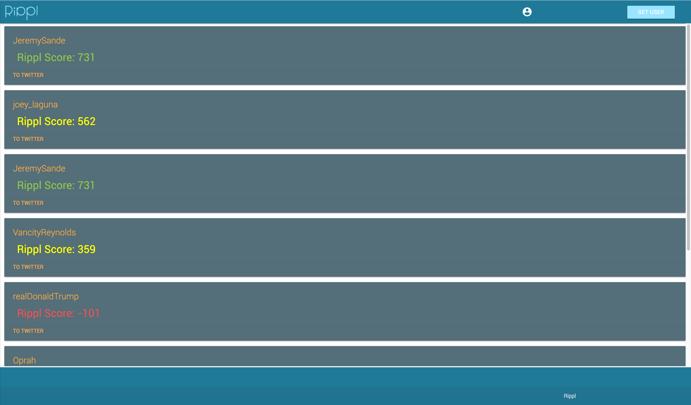

# Rippl


### getting started
To get started, you will need some API keys to make everything work.  Please get API keys for the following:

1. https://dev.twitter.com/
2. https://www.havenondemand.com/

Once you have API keys, please remove the .example from haven.example.js and twitter.example.js and add your API keys into these files.

Once you have those two files setup, run npm install to get all the required packages.

Then run 
```javascript
npm start server
```
to start up your local express server.  From there, run 
```javascript
npm run dev-react
```
to load up all of your react files.

Finally, run 
```javascrit
npm run twitterscript
```
Once all these commands have been ran, navigate to localhost:3000 to use the app.  From here, you are able to get a Rippl score for any twitter user.
